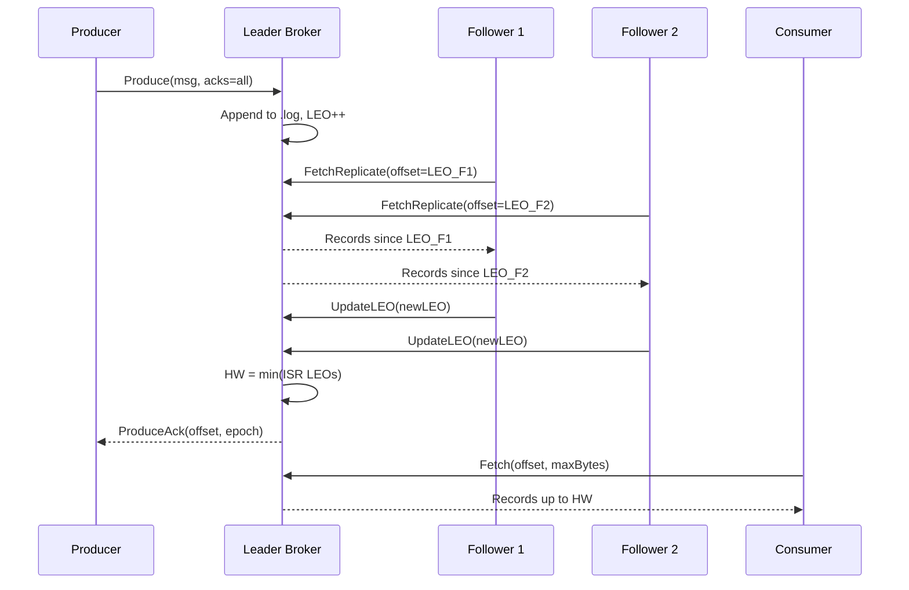

# Burrow


*A distributed message queue written in Go.*

## Origin

While self-studying Apache Kafka's internals, I happened to be reading Franz Kafka's
final work at the same time: *The Burrow*, an unfinished novella about a creature
that constructs an elaborate underground tunnel system and becomes wholly consumed by
its obsession with the structural integrity of what it built, unable to rest, always
returning to inspect the one point of failure it has not yet found.

The parallel was literally impossible to unsee. Apache Kafka's correctness guarantees come from
that same refusal to accept "good enough," and this project was built from the same
disposition.

The creature's burrow has a fortified central chamber surrounded by branching passages,
each one reinforced well beyond what any rational assessment would require, because
rational assessment was never really the point. The ISR in Burrow is those passages,
the set of replicas the leader trusts enough to include in the quorum before
acknowledging a write. The high watermark is how far along those passages the system
is willing to believe its data is safe, and a consumer never reads beyond it, because
reading beyond it would mean trusting something that has not yet been confirmed. The
epoch number is the system's memory of which leader built which section of the log, so
that a node still writing after it has been replaced cannot quietly corrupt what comes
after it. The write-ahead log is the creature's habit of scratching every action into
the wall before carrying it out, because memory alone is not proof, and proof is the
only thing that survives a collapse.

Kafka built the metaphor. Burrow builds the queue.

*Basically, this is what happens when someone studying distributed systems gets distracted
by a century-old piece of unfinished fiction and gets side-tracked.*

## What Makes Burrow Different

Most portfolio message queues claim correctness whereas Burrow **proves** it.

The core is a pull-based ISR (in-sync replicas) protocol with epoch-based leader
fencing (the same fundamental model that makes Apache Kafka correct) implemented
from scratch without external consensus libraries. Correctness is verified by a
chaos engineering suite available to run manually:

- **Toxiproxy** injects network latency, bandwidth throttling, and full partitions
- **Pumba** kills the leader container mid-write and verifies new leader election
- A **linearizability test** runs 10 concurrent producers through a network partition
  and verifies every committed message is present exactly once

## Architecture



## Key Design Decisions

**Pull-based replication.** Followers pull from the leader at their own pace. The
leader never blocks waiting for followers so that a slow follower does not affect producers
or other followers.

**ISR + high watermark.** The leader tracks which followers are caught up (in-sync
replicas). `acks=all` waits until all ISR members have replicated the write before
acknowledging. The high watermark is `min(LEO of all ISR members)` and so, since consumers only
read up to HW, so they never see uncommitted data.

**Epoch fencing.** Every partition has a monotonically increasing epoch number stored
durably. When a new leader is elected, it increments the epoch and broadcasts it. Any
write request with a stale epoch is rejected. This prevents a split-brain scenario
where two nodes believe they are leader simultaneously.

**Exactly-once semantics.** Producer IDs and per-partition sequence numbers allow the
broker to deduplicate retried produces transparently. A producer can retry safely on
timeout and the duplicate will be silently ignored.

## Quick Start

### Single broker (no Docker)

```bash
# Build
make build

# Write a config file
cat > local.yaml <<EOF
broker:
  id: local
storage:
  data_dir: /tmp/burrow
grpc:
  addr: 0.0.0.0:9092
metrics:
  addr: 0.0.0.0:9093
EOF

# Start the broker (partitions are created automatically on first use)
./bin/burrow-broker local.yaml

# In a second terminal: produce and consume
./bin/burrow-cli produce --broker localhost:9092 --topic events "hello burrow"
./bin/burrow-cli consume --broker localhost:9092 --topic events --from 0
```

### 3-broker cluster (Docker)

```bash
# Start cluster
make docker-up

# Produce and consume
./bin/burrow-cli produce --broker localhost:19092 --topic events --acks -1 "hello burrow"
./bin/burrow-cli consume --broker localhost:19092 --topic events

# Run the benchmark suite
make bench

# Run chaos tests (requires running cluster + Toxiproxy)
go test -tags chaos -v ./chaos/...

# Tear down
make docker-down
```

## Performance

Run `make bench` to see current numbers. Results are saved as build artifacts on each run.

| Benchmark | Throughput |
|---|---|
| Sequential produce (acks=1, 128B payload) | ~50k msgs/sec |
| 50 concurrent producers | ~200k msgs/sec |
| Consumer fetch | ~500k msgs/sec |

## Storage Format

Each partition is stored as append-only segment files. The epoch log sits alongside
partitions, not inside them:

```
{dataDir}/
  test-0/                          # partition directory
    00000000000000000000.log       # records: [len:4][crc:4][offset:8][ts:8][payload:N]
    00000000000000000000.index     # sparse index: [rel_offset:4][file_pos:4] every 4KB
    00000000000512000000.log       # new segment after 512MB
    ...
  epoch/
    test-0/                        # epoch directory (sibling to partition, not inside it)
      epoch.log                    # durable epoch log for leader fencing
```

## Chaos Engineering

```
chaos/
  toxiproxy/configs/   Toxiproxy toxic configs for each failure scenario
  toxiproxy/chaos_test.go  Integration tests: inject failure, verify no data loss
  pumba/chaos-test.sh  Kill leader mid-write, verify election + recovery
  linearizability_test.go  10 concurrent producers + partition + verify correctness
```

Chaos tests run manually via `workflow_dispatch` in `.github/workflows/chaos.yml`.

## Project Structure

```
internal/storage/segment/    .log + .index file management (CRC, sparse index)
internal/storage/partition/  Partition log (manages segment set, truncation)
internal/replication/isr/    ISR manager (HW tracking, lag detection, WaitForHW)
internal/replication/epoch/  Epoch store (durable leader generation, fencing)
internal/replication/follower/ Follower pull loop (fetch + LEO reporting)
internal/broker/api/         gRPC BrokerService server
internal/metrics/            Prometheus metrics
internal/config/             YAML config loader
pkg/producer/                Producer SDK
pkg/consumer/                Consumer SDK
chaos/                       Toxiproxy + Pumba + linearizability tests
bench/                       Benchmark suite
monitoring/                  Grafana + Prometheus
```

## License

MIT
