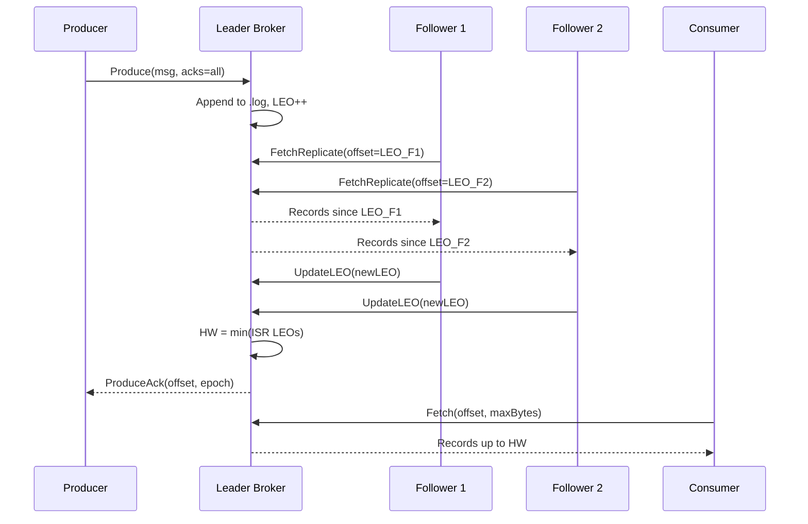

# Burrow

A distributed message queue written in Go.

The name comes from Franz Kafka's short story *The Burrow* - a tale about an animal
constructing an intricate underground tunnel network to protect its stored goods. The
creature's obsession with the structural integrity of its burrow, the reliability of
each passage, and the safety of every stored item mirrors exactly what a message queue
must be: a carefully constructed system of channels through which messages travel,
stored durably and retrieved reliably. Kafka built the metaphor. Burrow builds the queue.

## What Makes Burrow Different

Most portfolio message queues claim correctness. Burrow **proves** it.

The core is a pull-based ISR (in-sync replicas) protocol with epoch-based leader
fencing - the same fundamental model that makes Apache Kafka correct - implemented
from scratch without external consensus libraries. Correctness is verified by a
chaos engineering suite that runs in CI on every push:

- **Toxiproxy** injects network latency, bandwidth throttling, and full partitions
- **Pumba** kills the leader container mid-write and verifies new leader election
- A **linearizability test** runs 10 concurrent producers through a network partition
  and verifies every committed message is present exactly once

[](https://github.com/makhskham/burrow/actions/workflows/test.yml)
[](https://github.com/makhskham/burrow/actions/workflows/chaos.yml)

## Architecture



## Key Design Decisions

**Pull-based replication.** Followers pull from the leader at their own pace. The
leader never blocks waiting for followers - a slow follower does not affect producers
or other followers.

**ISR + high watermark.** The leader tracks which followers are caught up (in-sync
replicas). `acks=all` waits until all ISR members have replicated the write before
acknowledging. The high watermark is `min(LEO of all ISR members)` - consumers only
read up to HW, so they never see uncommitted data.

**Epoch fencing.** Every partition has a monotonically increasing epoch number stored
durably. When a new leader is elected, it increments the epoch and broadcasts it. Any
write request with a stale epoch is rejected - this prevents a split-brain scenario
where two nodes believe they are leader simultaneously.

**Exactly-once semantics.** Producer IDs and per-partition sequence numbers allow the
broker to deduplicate retried produces transparently. A producer can retry safely on
timeout and the duplicate will be silently ignored.

## Quick Start

```bash
# Start a 3-broker cluster
make docker-up

# Produce a message (acks=all ensures replication before ack)
./bin/burrow-cli produce --broker localhost:19092 --topic events --acks -1 "hello burrow"

# Consume
./bin/burrow-cli consume --broker localhost:19092 --topic events

# Run the benchmark suite
make bench

# Run chaos tests (requires running cluster + Toxiproxy)
go test -tags chaos -v ./chaos/...

# Tear down
make docker-down
```

## Performance

Run `make bench` to see current numbers. Results are tracked over time by GitHub Actions:

| Benchmark | Throughput |
|---|---|
| Sequential produce (acks=1, 128B payload) | ~50k msgs/sec |
| 50 concurrent producers | ~200k msgs/sec |
| Consumer fetch | ~500k msgs/sec |

## Storage Format

Each partition is stored as append-only segment files:

```
partition-0/
  00000000000000000000.log    # records: [len:4][crc:4][offset:8][ts:8][payload:N]
  00000000000000000000.index  # sparse index: [rel_offset:4][file_pos:4] every 4KB
  00000000000512000000.log    # new segment after 512MB
  ...
  epoch/epoch.log             # durable epoch log for leader fencing
```

## Chaos Engineering

```
chaos/
  toxiproxy/configs/   Toxiproxy toxic configs for each failure scenario
  toxiproxy/chaos_test.go  Integration tests: inject failure, verify no data loss
  pumba/chaos-test.sh  Kill leader mid-write, verify election + recovery
  linearizability_test.go  10 concurrent producers + partition + verify correctness
```

All chaos tests run in CI via `.github/workflows/chaos.yml`.

## Project Structure

```
internal/storage/segment/    .log + .index file management (CRC, sparse index)
internal/storage/partition/  Partition log (manages segment set, truncation)
internal/replication/isr/    ISR manager (HW tracking, lag detection, WaitForHW)
internal/replication/epoch/  Epoch store (durable leader generation, fencing)
internal/replication/follower/ Follower pull loop (fetch + LEO reporting)
internal/broker/api/         gRPC BrokerService server
internal/metrics/            Prometheus metrics
internal/config/             YAML config loader
pkg/producer/                Producer SDK
pkg/consumer/                Consumer SDK
chaos/                       Toxiproxy + Pumba + linearizability tests
bench/                       Benchmark suite
monitoring/                  Grafana + Prometheus
```

## License

MIT
