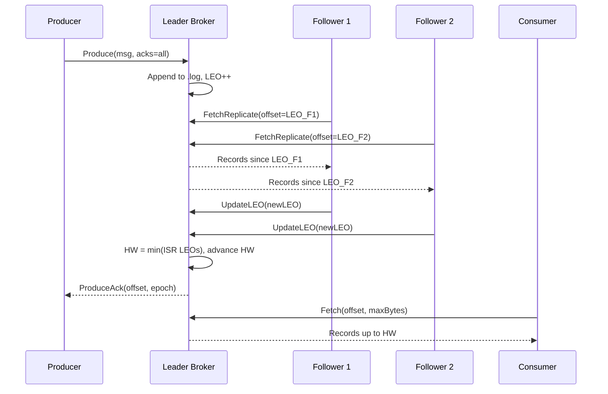

# Burrow - Distributed Message Queue Design Spec

**Date:** 2026-05-30
**Status:** Approved
**Project path:** `C:\Users\makhs\Desktop\Projects\burrow`

---

## Overview

Burrow is a distributed message queue written in Go with a deliberate focus on **replication correctness** over feature breadth. The name comes from Franz Kafka's short story *The Burrow* - a story about an animal constructing an intricate underground tunnel network to protect its stored goods. A message queue is exactly that: a carefully constructed system of channels through which messages travel, stored durably and retrieved reliably.

The core design choice is a **pull-based ISR (in-sync replicas) protocol with a custom epoch/generation protocol for leader election** - the same fundamental model that makes Apache Kafka correct. Burrow implements this from scratch without external consensus libraries, going exceptionally deep on replication safety, and proves correctness through an integrated chaos engineering test suite using Toxiproxy and Pumba.

---

## Goals

- Implement a pull-based ISR replication protocol from scratch
- Prove correctness under network failures and broker crashes via automated chaos tests in CI
- Provide a clean, documented producer/consumer Go SDK
- Ship a 3-broker Docker Compose cluster that is easy to spin up
- Track benchmark performance over time via GitHub Actions

## Non-Goals

- Feature parity with Apache Kafka
- Consumer group rebalancing beyond a basic implementation
- Multi-datacenter replication
- Schema registry or message serialization opinions

---

## Core Concepts

| Term | Definition |
|---|---|
| **Topic** | A named stream of messages, divided into partitions |
| **Partition** | An ordered, append-only log. The unit of parallelism and replication |
| **Broker** | A node that stores partitions and serves producers/consumers |
| **Leader** | The broker that accepts writes for a given partition |
| **Follower** | A broker that replicates a partition by pulling from the leader |
| **ISR** | In-sync replicas - the set of followers caught up with the leader |
| **LEO** | Log End Offset - the next offset to be written on a replica |
| **HW** | High Watermark - min(LEO of all ISR members) - the safe read boundary |
| **Epoch** | A monotonically increasing generation number per partition, incremented on leader change |

---

## Architecture

```
Producers
    |  gRPC
    v
+-------------------+     replication pull     +-------------------+
|   Broker (Leader) |  <--------------------   |  Broker (Follower)|
|                   |                          |                   |
|  Partition Log    |                          |  Partition Log    |
|  - segment/*.log  |                          |  - segment/*.log  |
|  - segment/*.index|                          |  - segment/*.index|
|                   |                          |                   |
|  ISR Manager      |                          |                   |
|  Epoch Manager    |                          |                   |
+-------------------+                          +-------------------+
    |  gRPC
    v
Consumers
```



---

## Storage Layer

### Segment Files

Each partition is stored as a series of immutable segment files plus one active segment.

**`.log` file** - sequential append of fixed-frame records:
```
[length: 4 bytes][crc32: 4 bytes][offset: 8 bytes][timestamp: 8 bytes][payload: N bytes]
```

**`.index` file** - sparse index, one entry per 4KB of `.log` data:
```
[relative_offset: 4 bytes][file_position: 4 bytes]
```

Offset lookup: binary search `.index` for the largest entry <= target offset, then scan `.log` from that file position.

**Segment rollover:** when the active segment exceeds `segment.max.bytes` (default 512MB), a new segment is created. Old segments are read-only. Retention deletes segments older than `retention.ms` or beyond `retention.bytes`.

### Partition Log

Wraps the segment set. Exposes:
- `Append(records []Record) (baseOffset int64, err error)`
- `Read(offset int64, maxBytes int) ([]Record, error)`
- `TruncateTo(offset int64) error` - used during leader failover to discard uncommitted entries

---

## Replication Protocol

### Pull-based Replication

Followers initiate all replication traffic. Each follower runs a replication loop:

```
loop:
  fetch records from leader starting at my LEO
  append fetched records to local log
  report new LEO to leader
  sleep(replica.fetch.interval.ms)
```

The leader never pushes to followers. This decouples leader write performance from follower speed - a slow follower does not slow down the leader or other followers.

### ISR Management

The leader maintains the ISR set. Rules:

- A follower is **removed from ISR** if its LEO falls behind the leader LEO by more than `replica.lag.max.ms` milliseconds without catching up.
- A follower is **added back to ISR** when its LEO matches the leader's LEO (fully caught up).
- The **high watermark** advances to `min(LEO of all current ISR members)` after each successful follower fetch.
- A `ProduceAck` with `acks=all` is sent to the producer only after HW advances past the produce offset.

### Epoch Protocol (Leader Fencing)

Every partition has an epoch stored durably. On leader election:

1. The new leader increments the epoch and broadcasts it to all brokers.
2. Any write request arriving with an epoch less than the current epoch is rejected with `ErrStalEpoch`. This fences old leaders that did not know they were replaced.
3. The new leader reads the last committed HW from the previous epoch (stored in a durable epoch log). It truncates its own log to HW, discarding any entries that were written by the old leader but never committed. Followers do the same when they receive the new epoch.

### Leader Election

When a broker detects the leader is dead (missed heartbeats for `broker.heartbeat.timeout.ms`):

1. Any ISR member with the highest LEO may attempt to become leader.
2. It writes a new epoch entry to the epoch log.
3. It broadcasts `LeaderChanged(topic, partition, newLeaderID, newEpoch)` to all brokers.
4. If two brokers race, the one whose epoch entry is durably committed first wins. The other detects a higher epoch and stands down.

No external consensus library. The epoch log is a simple append-only file - durability comes from fsync, not distributed consensus.

### Exactly-Once Semantics

- Each producer is assigned a **producer ID** on first connect.
- Each produce request carries a **sequence number** per partition (monotonically increasing per producer).
- The broker deduplicates on `(producerID, partition, sequenceNum)` for the last N sequence numbers (configurable window).
- Retries after timeout are safe: the broker silently discards the duplicate and returns the original offset.

---

## Producer Protocol

**Connection:** producer connects to any broker. That broker acts as a router if it is not the partition leader - it returns a redirect with the current leader address for that partition.

**Delivery modes:**

| acks | Guarantee | When HW advances |
|---|---|---|
| `0` | Fire and forget | Never waits |
| `1` | Leader local write | After local append |
| `all` | All ISR confirmed | After HW advances past produce offset |

**Request:**
```protobuf
message ProduceRequest {
  string topic      = 1;
  int32  partition  = 2;
  int64  producer_id = 3;
  int64  sequence_num = 4;
  int32  acks       = 5;
  repeated bytes records = 6;
}
```

---

## Consumer Protocol

**Fetch request:** consumer sends `(topic, partition, offset, maxBytes)` to any broker. Brokers only serve records up to the current HW - a consumer never reads uncommitted data even from a follower.

**Offset management:** consumers track their own offset. They may also commit offsets to the broker (stored per consumer group, per partition). On restart the consumer fetches its last committed offset.

**Consumer groups:** a minimal coordinator assigns partitions to group members. When a member joins or leaves, the coordinator triggers a rebalance - partitions are reassigned round-robin. No sticky assignment in v1.

---

## Chaos Engineering Infrastructure

### Toxiproxy

`chaos/toxiproxy/` contains named toxic configurations:

| File | Scenario |
|---|---|
| `latency_200ms.json` | 200ms latency between leader and follower 1 |
| `partition_leader.json` | Complete network cut between leader and both followers |
| `bandwidth_10kbps.json` | Bandwidth throttle simulating a slow follower |
| `jitter_50ms.json` | Random latency jitter on all replication traffic |

Each scenario has a corresponding test in `chaos/toxiproxy/chaos_test.go` that:
1. Starts the toxic
2. Writes 1000 messages with `acks=all`
3. Heals the network
4. Waits for ISR to fully recover
5. Asserts the consumer reads exactly 1000 messages in order with no gaps

### Pumba

`chaos/pumba/chaos-test.sh`:
1. Spins up 3-broker Docker Compose cluster
2. Starts a producer writing continuously
3. Pumba kills the leader broker container after 5 seconds
4. Waits for new leader election (measured and asserted < 2 seconds)
5. Resumes producer
6. Tears down cluster
7. Reads all messages back from fresh consumer
8. Asserts no gaps in the offset sequence

### Linearizability Test

`chaos/linearizability_test.go`:
- 10 concurrent producers each writing 100 unique tagged messages
- Toxiproxy partitions the network at t=2s
- Network healed at t=5s
- Single consumer reads all messages from offset 0
- Asserts: all 1000 unique message IDs present, no duplicates, per-producer ordering preserved

---

## Observability

### Prometheus Metrics

| Metric | Type | Description |
|---|---|---|
| `burrow_messages_produced_total` | Counter | Messages produced per topic/partition |
| `burrow_messages_consumed_total` | Counter | Messages consumed per consumer group |
| `burrow_replication_lag_offsets` | Gauge | Leader LEO minus follower LEO per replica |
| `burrow_isr_size` | Gauge | Current ISR size per partition |
| `burrow_high_watermark` | Gauge | Current HW per partition |
| `burrow_produce_latency_seconds` | Histogram | End-to-end produce latency by acks mode |
| `burrow_leader_elections_total` | Counter | Number of leader elections per partition |
| `burrow_epoch` | Gauge | Current epoch per partition |

### OpenTelemetry

Trace context propagated through produce request headers. A single trace spans:
- `producer.send` - client side
- `broker.append` - leader write
- `replication.fetch` - follower pull
- `consumer.fetch` - consumer read

### Grafana

`monitoring/docker-compose.yml` spins up Grafana + Prometheus scraping all brokers. Pre-built dashboard JSON in `monitoring/grafana/burrow-dashboard.json`. Screenshot in README.

---

## GitHub Actions CI

### `test.yml`
```yaml
strategy:
  matrix:
    go: ["1.22", "1.23", "1.24"]
    os: [ubuntu-latest, macos-latest]
steps:
  - run: go test -race -timeout 120s ./...
  - run: go vet ./...
```

### `bench.yml`
- Runs `go test -bench=. -benchmem ./bench/...`
- Publishes results via `benchmark-action/github-action-benchmark`
- Results tracked on `gh-pages` branch - a dynamic chart in the README shows throughput over time

### `chaos.yml`
- Runs on every push to `main`
- Spins up Docker, starts 3-broker cluster
- Runs full Toxiproxy chaos suite
- Passes/fails the workflow - badge in README

---

## Project Structure

```
burrow/
├── cmd/
│   ├── broker/             # broker server binary
│   └── cli/                # producer/consumer/admin CLI
├── internal/
│   ├── storage/
│   │   ├── segment/        # .log + .index file management
│   │   └── partition/      # partition log (manages segment set)
│   ├── replication/
│   │   ├── isr/            # ISR manager, HW tracking, LEO per follower
│   │   ├── epoch/          # epoch protocol, leader election, fencing
│   │   └── follower/       # follower pull loop client
│   ├── broker/
│   │   ├── api/            # gRPC server (produce, fetch, replicate)
│   │   └── coordinator/    # consumer group coordinator
│   ├── cluster/            # broker membership, discovery (memberlist)
│   └── metrics/            # Prometheus collectors, OTel trace setup
├── pkg/
│   ├── producer/           # public producer SDK (documented for pkg.go.dev)
│   └── consumer/           # public consumer SDK
├── proto/                  # protobuf definitions + generated Go code
├── chaos/
│   ├── toxiproxy/          # toxic configs + chaos_test.go
│   ├── pumba/              # chaos-test.sh
│   └── linearizability_test.go
├── bench/                  # benchmark suite (throughput, latency, failover time)
├── monitoring/             # Grafana + Prometheus docker-compose + dashboard JSON
├── configs/
│   ├── broker1.yaml
│   ├── broker2.yaml
│   └── broker3.yaml
├── .github/
│   └── workflows/
│       ├── test.yml
│       ├── bench.yml
│       └── chaos.yml
├── docker-compose.yml      # 3-broker cluster
├── Makefile
└── README.md               # includes Burrow/Kafka metaphor, Mermaid diagrams, badges
```

---

## Milestones

| Phase | Deliverable | Done when |
|---|---|---|
| 1 | Storage layer - segment files, partition log, index | `burrow-cli produce` writes to disk and reads back correctly |
| 2 | Single-broker producer/consumer over gRPC | End-to-end produce + consume with `acks=1` |
| 3 | Replication - follower pull loop, ISR, HW advancement | 3-node cluster, `acks=all` works |
| 4 | Epoch protocol - leader election, fencing, log truncation | Killing the leader broker, new leader elected, no data loss |
| 5 | Chaos suite - Toxiproxy + Pumba + linearizability | All chaos tests pass in CI |
| 6 | Observability - Prometheus, OTel, Grafana | Dashboard screenshot in README |
| 7 | CI hardening - race detector, matrix, benchmark tracking | All GitHub Actions workflows green |
